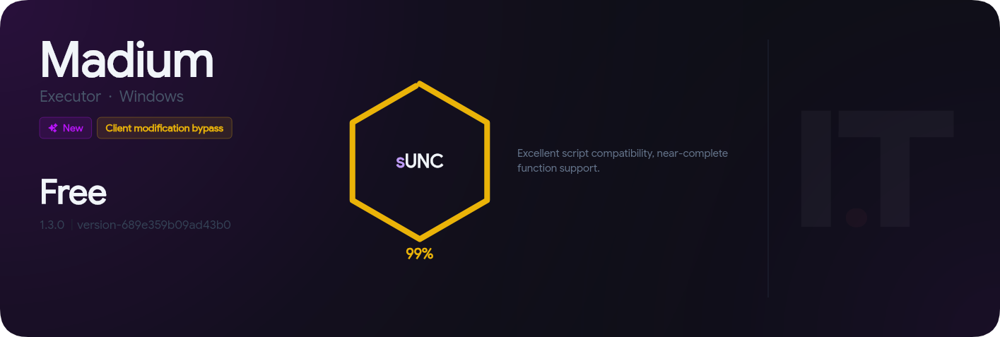

# Functions

### UNC/sUNC

> Madium's UNC/sUNC score is 99%, which means it is capable of executing any script or function you can think of. On the next page are all of the functions that Wave supports, starting with [console.md](console.md "mention") Functions.

<figure><figcaption></figcaption></figure>

